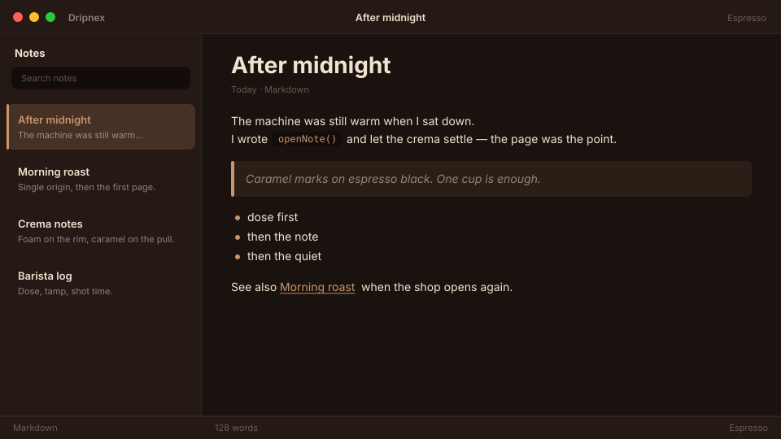

# Espresso

Coffee-shop dark. Roast brown, cream foam.



```
dripnex/theme-espresso
```

## Palette

The chips live in [palette.html](palette.html) — open it in a browser. GitHub won’t paint HTML swatches here, so the hex list is below.

| Name | Token | Color | What it’s for |
| --- | --- | --- | --- |
| Base | `--bg-base` | `#1a120e` | Window background |
| Surface | `--bg-surface` | `#241914` | Sidebar and chrome |
| Elevated | `--bg-elevated` | `#302218` | Raised panels |
| Text | `--text-primary` | `#f0e4d0` | Headings and body |
| Muted | `--text-muted` | `#f0e4d0 · rgba(240, 228, 208, 0.52)` | Secondary copy |
| Accent | `--accent` | `#c9956c` | Selection and links |
| Active | `--status-active` | `#c9956c` | Active status |
| Dropped | `--status-dropped` | `#c46b6b` | Dropped status |

Pick it for a late cup: cream foam on roast brown, caramel marks, no wood grain.
